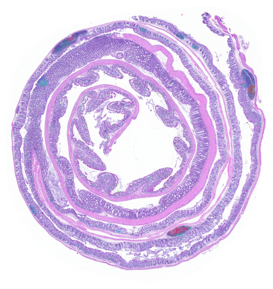

# Repository for: Computational immunohistochemical and H&E mapping adds immune context to histological phenotypes in colitis mouse models.

## [Soma Kobayashi, Christopher Sullivan, Agnieszka B. Bialkowska, Joel H. Saltz, Vincent W. Yang]

### Environment Setup: Please refer to INSTRUCTIONS.md in ENVIRONMENT folder

### Please download ROI_TIFs to run code at: https://drive.google.com/drive/folders/1m9O5uOvz2-aAelVJy0xdF2w-rJr_H8p5?usp=drive_link
--> ROI_tifs folder should be saved and absolute path to it should be used for data['directories']['ROI_INPUT_DIR'] in the generateJSON.py folder

### Please download the following two CSVs: 1) involved_wOverlap_RN_extractedFeatures_archivedMouseCohort.csv and 2) UNinvolved_patch_RN_FeatureExtraction/UNinvolved_wOverlap_RN_extractedFeatures_archivedMouseCohort.csv at: https://drive.google.com/drive/u/0/folders/1O6Bk57bmPSBSxkwlMpTY9pLQ9btt0laJ
--> please place both in ./6_mouseModelInference/RN_featureextraction_features/

### Running code:
### 1) ensure correct paths in data['directories']['ROI_INPUT_DIR'] and data['directories']['BASE_DIR'] in generateJSON.py
### 2) python run_pipeline_Part1.py
### 3) python run_pipeline_Part2.py
### 4) python run_pipeline_Part3.py

### Overview:
- Contains code to register extracted ROIs from swiss rolls. WSIs were first aligned according to WSIReg2d (https://github.com/NHPatterson/wsireg) 
    ROI tifs in /ROI_tifs/goodreg_qual_ROIs showed good registration quality and were extracted from registered WSIs
    ROI tifs in /ROI_tifs/bad_reg_qual_ROIs showed inadequate registration quality so registration is repeated on these tifs in this pipeline
- Once aligned, pipeline performs patch extraction at current resolution and one downsampled by additional factor of 4
    at current resolution: IHC detection for CD3, CD4, CD8b are performed
    at downsampled resolution: 'Involved' versus 'Uninvolved' patch classifications and subsequent kMeans clustering into kMeans patch classes
- IHC and H&E otuputs are then combined
